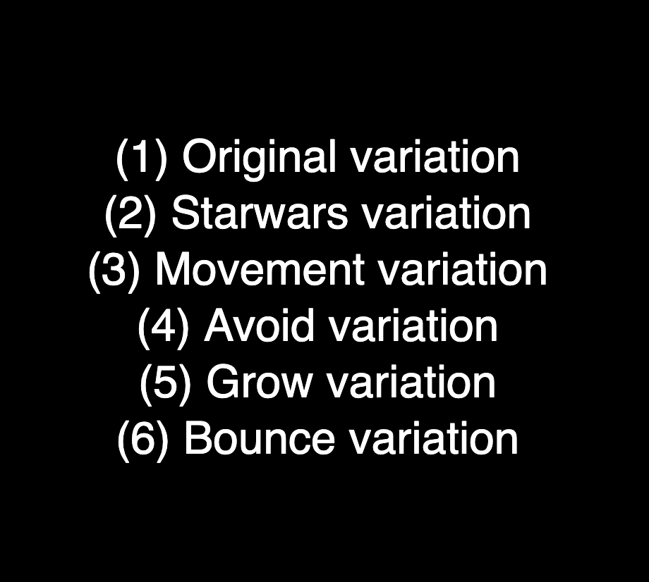
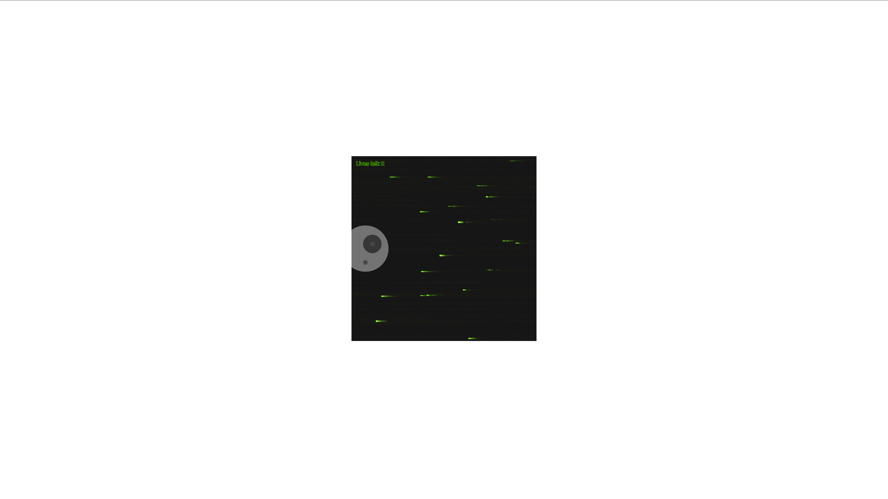
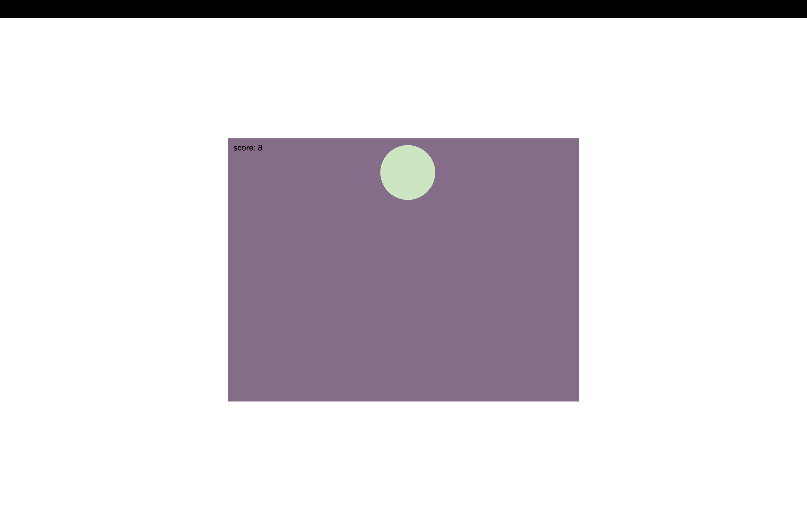
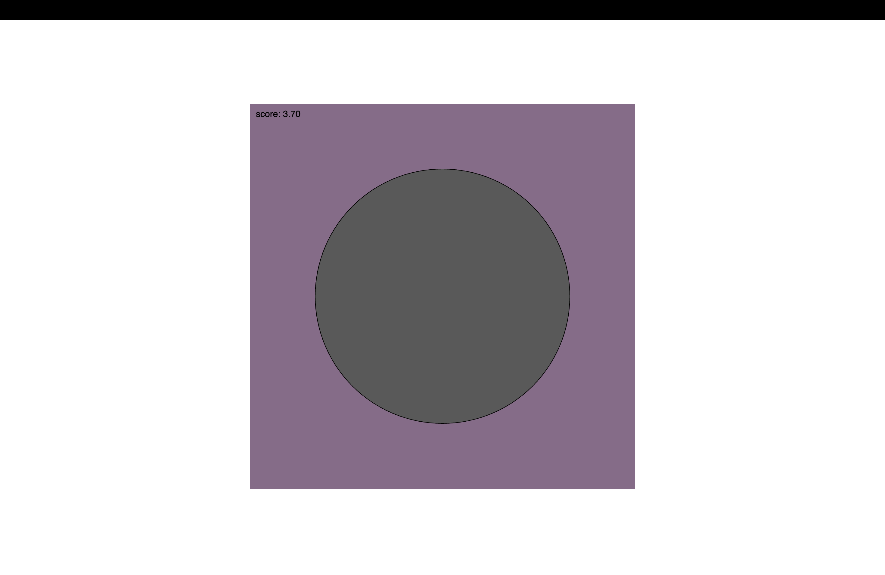

# Variation Jam - The Cricles of Life

Alex Chardon

[View this project online](https://crooksnwhiskey.github.io/CART253/topics/assignments/variation-jam)

## Description

This variation jam is supposed to show off 6 different games featuring Circles.

The objectives of the games aren't clear... neither are the instructions

Can you figure them all out?

## Screenshot(s)

This bit should have some images of the program running so that the reader has a sense of what it looks like. For example:

> 
> 
> 
> 

## Attribution

> - This project uses [p5.js](https://p5js.org).
> - code for the noise in the movement game taken from https://p5js.org/reference/p5/noise/
> - This project uses Pippin Barr's menu template https://github.com/pippinbarr/cart253/tree/main/templates/variations-menu

